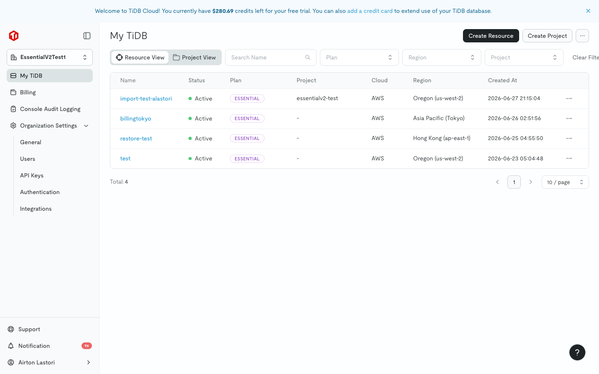
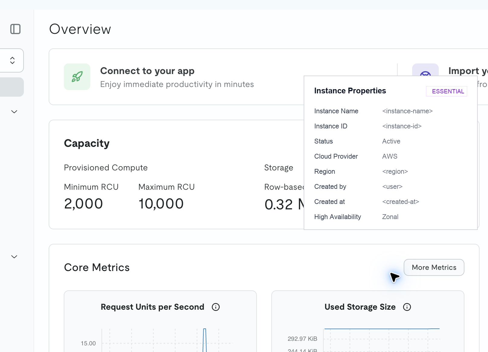
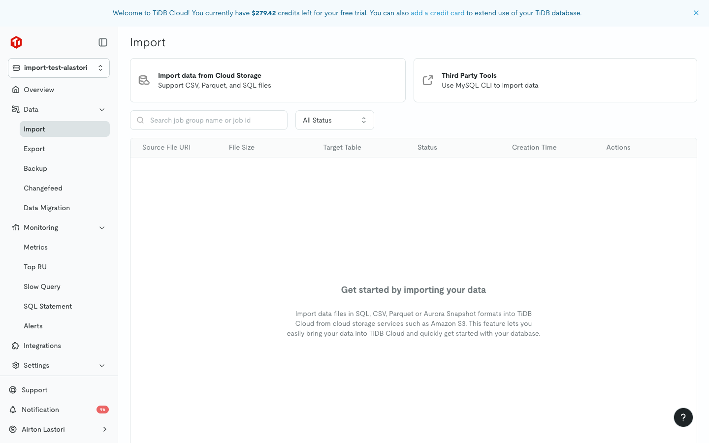
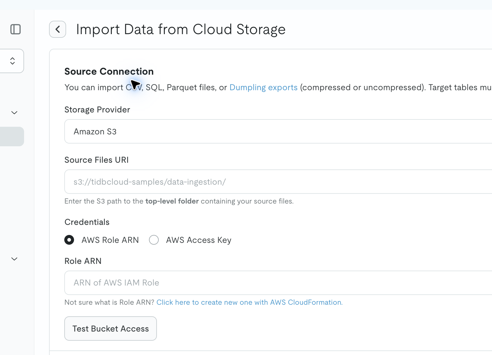
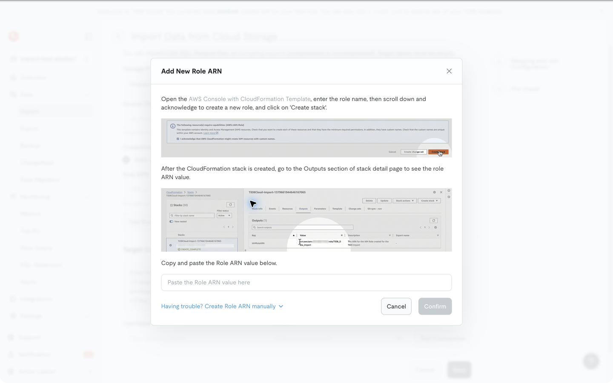
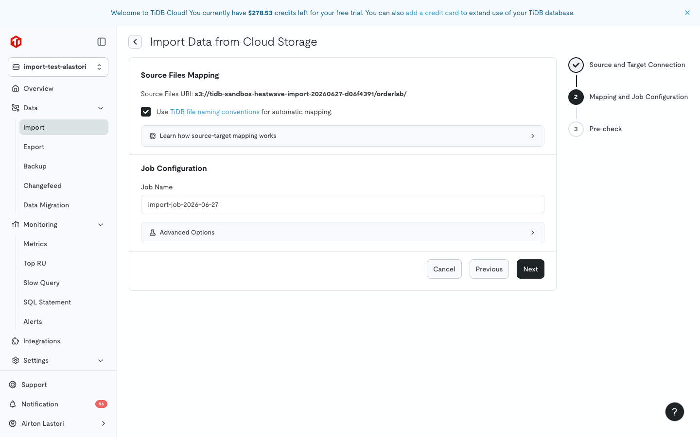
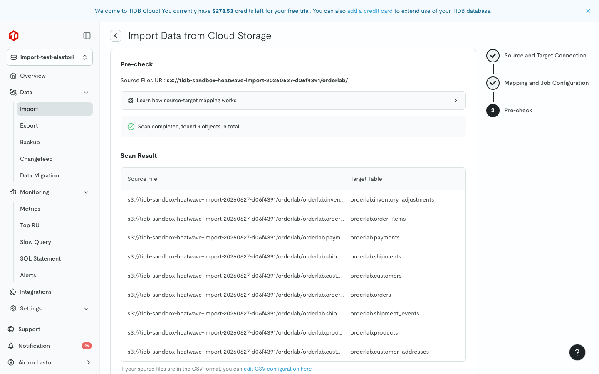
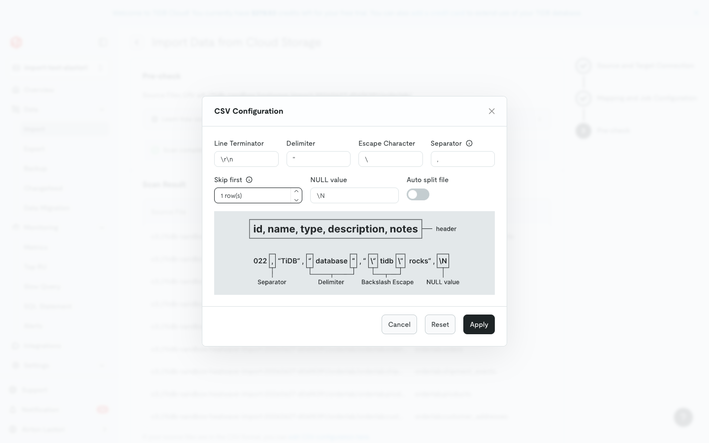
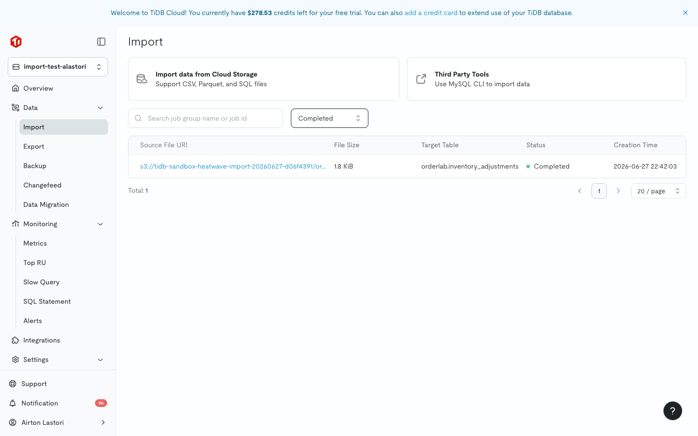

<!-- lab-meta
archetype: manual-exploration
status: released
products: [dumpling, tidb-cloud, mysql]
-->

# Lab 03 - HeatWave on AWS CSV Export to S3 and Import into TiDB Cloud

**Goal:** Validate a manual full-load path from MySQL HeatWave on AWS into TiDB Cloud using Dumpling CSV export, Amazon S3 staging, TiDB Cloud import in physical import mode, and post-import verification.

## When To Use This Lab

Use this lab when you need a full-load migration path from MySQL HeatWave on AWS to TiDB Cloud and can use Amazon S3 as the staging location. The flow is useful when you want to validate the baseline load first, then evaluate incremental replication separately.

The tested flow, screenshots, and step-by-step instructions assume a TiDB Cloud Essential target instance. The same pattern should work with other TiDB Cloud tiers with small adjustments to target provisioning, connection details, import access, and UI labels.

In this lab, you will:

- Confirm SQL access to the HeatWave source and TiDB Cloud target.
- Export schema locally and CSV data directly to S3 with Dumpling.
- Use the Dumpling schema files as the source of truth for target DDL preparation.
- Import the S3 data into TiDB Cloud in physical import mode.
- Verify the target with row-count checks and a simple compatibility check.
- Preserve the Dumpling metadata needed to plan a later incremental replication setup, such as with TiDB Data Migration (DM).

This lab does not configure or validate incremental replication. Treat that as a follow-up after the physical full-load path is confirmed.

## Tested Environment

The validation run for this lab used the optional `orderlab` sample schema in [Appendix B - Optional Sample Schema](#appendix-b---optional-sample-schema).

- Source: MySQL HeatWave on AWS, MySQL Enterprise - Cloud `9.7.0-cloud`.
- Source connectivity: public inbound allowlist, MySQL port `3306`, SSL required.
- Export tool: Dumpling `v8.5.6`, Git commit `ae18096e023780bb56bfce33698abec0d4640d0a`.
- TiUP: `1.16.4 v1.16.2-nightly-74`, Git hash `e525ada49ad0223167b9fd7e5902f568e5eca3c4`.
- Target: TiDB Cloud Essential on AWS, public endpoint, TiDB `8.0.11-TiDB-CLOUD.202603.3`.
- Staging: Amazon S3 in `us-east-1`, private bucket, TiDB Cloud import access through an AWS IAM role.
- Lab client host: macOS `26.5.1` on `arm64`.
- MySQL client: `mysql Ver 9.7.1 for macos26.4 on arm64 (Homebrew)`.
- AWS CLI: `aws-cli/2.33.12 Python/3.13.11 Darwin/25.5.0 source/arm64`.

Private hostnames, account IDs, bucket names, role names, user emails, and credentials are intentionally omitted from the published lab.

## Prerequisites

Cloud resources and access:

- MySQL HeatWave on AWS DB System reachable from the lab client host on port `3306`.
- TiDB Cloud account access with permission to create an Essential target instance.
- AWS access that can create or use a staging S3 bucket and later create or update the IAM role, trust policy, and prefix-scoped S3 read policy that TiDB Cloud import uses to read that bucket.

A lab client host with:

- POSIX-compatible shell and utilities on Linux or macOS, including `mkdir` and `diff`. On Windows, run the lab in [WSL 2](https://learn.microsoft.com/en-us/windows/wsl/about) or another Linux environment. Native PowerShell and Command Prompt are not covered by this lab because the TiUP install path used for Dumpling is documented for Darwin and Linux.
- Network access to the HeatWave source and, after it is created, the TiDB Cloud target instance.
- `mysql` CLI installed.
- TiUP installed. See [TiUP Overview - Install TiUP](https://docs.pingcap.com/tidb/stable/tiup-overview/#install-tiup).
- Dumpling installed. Install through TiUP or confirm the version with `tiup install dumpling && tiup dumpling --version`.
- AWS CLI installed and authenticated for the AWS account used by the staging bucket.

## Step 1 - Confirm Source Access and Scope

Set the source connection details for the HeatWave DB System.

```bash
export HEATWAVE_HOST="replace-with-source-host"
export HEATWAVE_PORT="3306"
export HEATWAVE_USER="admin"
export HEATWAVE_PASSWORD="replace-with-source-password"
export SOURCE_DB="replace-with-source-database"
export HEATWAVE_DUMPLING_TLS_ARGS=""
```

If you do not have a source schema ready for a lab run, create the sample schema and seed data in [Appendix B - Optional Sample Schema](#appendix-b---optional-sample-schema), then return here.

Confirm the HeatWave source is reachable and that the intended database exists.

```bash
cd labs/import-into/lab-03-heatwave-csv-import

mysql \
  --host "${HEATWAVE_HOST}" \
  --port "${HEATWAVE_PORT}" \
  --user "${HEATWAVE_USER}" \
  --ssl-mode=REQUIRED \
  -p \
  -e "SELECT @@version; SHOW DATABASES LIKE '${SOURCE_DB}';"
```

If the source requires a custom CA or mutual TLS, set `HEATWAVE_DUMPLING_TLS_ARGS` before running Dumpling. Dumpling supports `--ca`, `--cert`, and `--key` for TLS connections.

```bash
export HEATWAVE_DUMPLING_TLS_ARGS="--ca /path/to/ca.pem"
```

Capture exact source row counts before exporting for post-import comparison. This row-count comparison assumes the source tables do not receive writes between the count capture and the Dumpling export. Dumpling metadata is preserved later for replication coordinates, but it does not include this comparison data.

```bash
mkdir -p "results/${SOURCE_DB}"

mysql \
  --host "${HEATWAVE_HOST}" \
  --port "${HEATWAVE_PORT}" \
  --user "${HEATWAVE_USER}" \
  --ssl-mode=REQUIRED \
  -p \
  --batch \
  --raw \
  --database information_schema \
  -e "
    SET SESSION group_concat_max_len = 1024 * 1024;
    SET @source_db = '${SOURCE_DB}';
    SET @row_count_sql = (
      SELECT GROUP_CONCAT(
        CONCAT(
          'SELECT ', QUOTE(table_name),
          ' AS table_name, COUNT(*) AS row_count FROM \`',
          REPLACE(table_schema, '\`', '\`\`'), '\`.\`',
          REPLACE(table_name, '\`', '\`\`'), '\`'
        )
        ORDER BY table_name
        SEPARATOR ' UNION ALL '
      )
      FROM tables
      WHERE table_schema = @source_db
        AND table_type = 'BASE TABLE'
    );

    SET @row_count_sql = IF(
      @row_count_sql IS NULL,
      'SELECT NULL AS table_name, 0 AS row_count WHERE FALSE',
      CONCAT(
        'SELECT table_name, row_count FROM (',
        @row_count_sql,
        ') AS counts ORDER BY table_name'
      )
    );

    PREPARE stmt FROM @row_count_sql;
    EXECUTE stmt;
    DEALLOCATE PREPARE stmt;
  " > "results/${SOURCE_DB}/source-row-counts.tsv"
```

## Step 2 - Export Source Schema with Dumpling

Confirm TiUP is installed, install Dumpling through TiUP if needed, and capture the Dumpling version before export:

```bash
tiup --version
tiup install dumpling
tiup dumpling --version
```

Export schema only into a local working directory. The `--no-data` option makes this a schema-only export. Keep this local because the schema needs review and adaptation before it is applied to TiDB.

```bash
rm -rf "schema/${SOURCE_DB}"
mkdir -p "schema/${SOURCE_DB}"

tiup dumpling \
  --host "${HEATWAVE_HOST}" \
  --port "${HEATWAVE_PORT}" \
  --user "${HEATWAVE_USER}" \
  --password "${HEATWAVE_PASSWORD}" \
  ${HEATWAVE_DUMPLING_TLS_ARGS} \
  --database "${SOURCE_DB}" \
  --filetype sql \
  --output "schema/${SOURCE_DB}" \
  --threads 4 \
  --consistency lock \
  --no-data \
  --compress no-compression
```

Confirm Dumpling wrote one database schema file and one table schema file per table:

```bash
find "schema/${SOURCE_DB}" -maxdepth 1 -type f | sort
```

Expected naming shape:

```text
schema/<source-db>/<source-db>-schema-create.sql
schema/<source-db>/<source-db>.<table-name>-schema.sql
```

> **Note:** This lab uses `--consistency lock` for Dumpling commands that connect to HeatWave. Dumpling's default `auto` consistency uses `flush` for MySQL, which uses `FLUSH TABLES WITH READ LOCK` and requires `RELOAD`. The `lock` mode uses read locks on exported tables and requires `LOCK TABLES` instead. This matters for HeatWave on AWS because the validation run for this lab had `LOCK TABLES` and `FLUSH_TABLES`, but not `RELOAD`.

## Step 3 - Prepare TiDB Target DDL

For CSV import, TiDB Cloud loads rows into existing tables, so create the target database and empty tables before starting the import. Use the Dumpling schema files generated in [Step 2](#step-2---export-source-schema-with-dumpling) as the starting point, then review the combined DDL for TiDB compatibility.

Set the target database name and the path for the combined DDL file:

```bash
export TARGET_DB="${SOURCE_DB}"
export TARGET_SCHEMA_SQL="schema/${SOURCE_DB}/target-schema.sql"
```

Generate a single `TARGET_SCHEMA_SQL` file from the Dumpling schema files. For schemas without inline foreign key dependencies, a sorted concatenation is usually enough:

```bash
{
  cat "schema/${SOURCE_DB}/${SOURCE_DB}-schema-create.sql"
  printf 'USE `%s`;\n' "${TARGET_DB}"
  find "schema/${SOURCE_DB}" \
    -maxdepth 1 \
    -name "${SOURCE_DB}.*-schema.sql" \
    -print \
    | sort \
    | xargs cat
} > "${TARGET_SCHEMA_SQL}"
```

Review `TARGET_SCHEMA_SQL` before applying it. Typical adaptations include reordering generated table files when inline foreign keys require referenced tables to be created first, removing source-specific table options that TiDB does not accept, and normalizing legacy character sets or collations if needed. Keep the main flow narrow: make the DDL valid for TiDB, create empty target tables, then import the CSV files. See [Appendix A - Target DDL Compatibility Notes](#appendix-a---target-ddl-compatibility-notes) for links and troubleshooting guidance.

For [Appendix B - Optional Sample Schema](#appendix-b---optional-sample-schema), use the Dumpling-generated schema files from [Step 2](#step-2---export-source-schema-with-dumpling). The sample appendix includes the dependency-ordered concatenation command for that schema.

## Step 4 - Create or Select an S3 Staging Bucket

Choose the S3 bucket and prefix that Dumpling will write to and TiDB Cloud import will read from. If a staging bucket does not already exist, create one with the AWS CLI. For `us-east-1`, do not pass a `CreateBucketConfiguration`.

```bash
export AWS_PROFILE="replace-with-aws-profile"
export AWS_SDK_LOAD_CONFIG=1
export AWS_REGION="us-east-1"
export S3_BUCKET="replace-with-existing-or-new-bucket"
export S3_PREFIX="${SOURCE_DB}/"
export S3_URI="s3://${S3_BUCKET}/${S3_PREFIX}"
```

The AWS CLI uses `--profile "${AWS_PROFILE}"` in this lab. Dumpling uses the AWS SDK credential chain for direct S3 writes. If you use a named AWS profile, keep `AWS_PROFILE` and `AWS_SDK_LOAD_CONFIG=1` exported in the same shell before running Dumpling.

If you need to create a new bucket for the lab, run:

```bash
export S3_BUCKET="tidb-sandbox-heatwave-import-$(date -u +%Y%m%d)-$(openssl rand -hex 4)"
export S3_URI="s3://${S3_BUCKET}/${S3_PREFIX}"

aws s3api create-bucket \
  --profile "${AWS_PROFILE}" \
  --region "${AWS_REGION}" \
  --bucket "${S3_BUCKET}"

aws s3api put-public-access-block \
  --profile "${AWS_PROFILE}" \
  --region "${AWS_REGION}" \
  --bucket "${S3_BUCKET}" \
  --public-access-block-configuration \
    BlockPublicAcls=true,IgnorePublicAcls=true,BlockPublicPolicy=true,RestrictPublicBuckets=true

aws s3api put-bucket-encryption \
  --profile "${AWS_PROFILE}" \
  --region "${AWS_REGION}" \
  --bucket "${S3_BUCKET}" \
  --server-side-encryption-configuration \
    '{"Rules":[{"ApplyServerSideEncryptionByDefault":{"SSEAlgorithm":"AES256"},"BucketKeyEnabled":true}]}'

aws s3api put-bucket-tagging \
  --profile "${AWS_PROFILE}" \
  --region "${AWS_REGION}" \
  --bucket "${S3_BUCKET}" \
  --tagging 'TagSet=[{Key=project,Value=tidb-sandbox},{Key=lab,Value=heatwave-manual-import}]'
```

The bucket remains private. You will grant TiDB Cloud prefix-scoped read access from the import wizard in [Step 9](#step-9---start-tidb-cloud-import-and-configure-s3-access).

## Step 5 - Export HeatWave Data and Preserve Replication Coordinates

Use the same `--consistency lock` setting for the data export. If the source environment cannot tolerate read locks, run during a maintenance window or use `--consistency none` and document the consistency risk.

Use `--no-schemas` because the lab creates the target schema explicitly in [Step 8](#step-8---create-target-tables).

Dumpling writes a `metadata` object that includes replication coordinates for the dump window: binlog file, position, and GTID set. Preserve it if you plan to configure incremental replication later, such as with TiDB Data Migration (DM). Optional commands are in [Appendix C - Optional Replication Coordinates](#appendix-c---optional-replication-coordinates).

```bash
tiup dumpling \
  --host "${HEATWAVE_HOST}" \
  --port "${HEATWAVE_PORT}" \
  --user "${HEATWAVE_USER}" \
  --password "${HEATWAVE_PASSWORD}" \
  ${HEATWAVE_DUMPLING_TLS_ARGS} \
  --database "${SOURCE_DB}" \
  --filetype csv \
  --output "${S3_URI}" \
  --s3.region "${AWS_REGION}" \
  --threads 8 \
  --filesize 100MiB \
  --compress gzip \
  --consistency lock \
  --no-header=false \
  --no-schemas \
  --output-filename-template '{{fn .DB}}.{{fn .Table}}.{{.Index}}'
```

Notes:

- In Dumpling v8.5.6, `.Index` is already a zero-padded string. Do not wrap it with `printf "%09d"`, or Dumpling generates filenames like `%!d(string=000000000)`.
- Dumpling's default CSV mode includes a header row unless `--no-header=true` is set. In the TiDB Cloud import wizard, configure the CSV settings to indicate that the files contain a header row.
- If you need to inspect Dumpling output locally before uploading it to S3, use [Appendix E - Troubleshooting - Local Export and S3 Sync](#appendix-e---troubleshooting---local-export-and-s3-sync).

## Step 6 - Confirm S3 CSV Objects

Confirm the S3 prefix contains the `${SOURCE_DB}.*.csv.gz` files that TiDB Cloud should import. Dumpling also writes a `metadata` object in the export prefix; keep it for later replication planning, but do not map it as an import file.

```bash
aws s3 ls "${S3_URI}" \
  --profile "${AWS_PROFILE}" \
  --region "${AWS_REGION}"
```

Expected S3 object layout:

```text
s3://<bucket>/<source-db>/<source-db>.<table-name>.000000000.csv.gz
s3://<bucket>/<source-db>/<source-db>.<table-name>.000000001.csv.gz
s3://<bucket>/<source-db>/<source-db>.<another-table>.000000000.csv.gz
```

If the expected CSV objects are missing, use [Appendix E - Troubleshooting - Local Export and S3 Sync](#appendix-e---troubleshooting---local-export-and-s3-sync) to isolate whether the issue is in Dumpling export or S3 upload.

## Step 7 - Confirm TiDB Cloud SQL Access

Confirm SQL access to the target TiDB Cloud Essential instance before creating target tables. This step assumes the target instance already exists. If it does not, create the instance in TiDB Cloud first, then return here.

If SQL access is not configured yet, use the TiDB Cloud UI first:

1. Open the target TiDB Cloud Essential instance overview page and click **Connect**.
2. Keep **Connection Type** as **Public**. If **Public** is disabled, go to **Settings** > **Networking** and enable the public endpoint.
3. Add the lab client host's current public IP address to the public endpoint IP access list.
4. In the **Connect** dialog, choose **MySQL CLI** and the lab client host OS, then copy the generated host, port, username, TLS mode, and CA guidance into your local environment variables.
5. If the target user does not have a password yet, generate one from the dialog and store it in your password manager. Do not save the password in this lab file, helper scripts, screenshots, or logs.





For more details, see [Connect to TiDB Cloud Starter or Essential via Public Endpoint](https://docs.pingcap.com/tidbcloud/connect-via-standard-connection-serverless/).

Set the target connection details from the TiDB Cloud Connect dialog:

```bash
export TIDB_HOST="replace-with-tidb-host"
export TIDB_PORT="4000"
export TIDB_USER="root"
export TIDB_PASSWORD="replace-with-target-password"
export TIDB_SSL_MODE="VERIFY_IDENTITY"
export TIDB_CA_PATH="replace-with-ca-path"
```

```bash
mysql --comments \
  --host "${TIDB_HOST}" \
  --port "${TIDB_PORT}" \
  --user "${TIDB_USER}" \
  --ssl-mode="${TIDB_SSL_MODE}" \
  --ssl-ca="${TIDB_CA_PATH}" \
  --connect-timeout=10 \
  -p \
  -e "
    SELECT @@version;
    SELECT CURRENT_USER() AS current_account;
    SELECT USER();
    SELECT DATABASE();
    SHOW STATUS LIKE 'Ssl_cipher';
  "
```

For TiDB Cloud Essential public endpoints, the TiDB Cloud Connect dialog provides the MySQL CLI command and CA guidance. Prefer `VERIFY_IDENTITY` with the CA path from the dialog. If CA verification fails during troubleshooting, `--ssl-mode=REQUIRED` can verify that the endpoint, credentials, IP access list, and TLS path work, but it does not verify server identity and should not be treated as final security validation.

## Step 8 - Create Target Tables

TiDB Cloud CSV import requires empty target tables. This lab creates the target tables before import using the reviewed target schema. If you rerun the lab, clean up the previous lab database before applying the schema again.

```bash
mysql \
  --host "${TIDB_HOST}" \
  --port "${TIDB_PORT}" \
  --user "${TIDB_USER}" \
  --ssl-mode="${TIDB_SSL_MODE}" \
  --ssl-ca="${TIDB_CA_PATH}" \
  -p \
  < "${TARGET_SCHEMA_SQL}"
```

Confirm the target objects exist and the target base tables are still empty:

```bash
mysql \
  --host "${TIDB_HOST}" \
  --port "${TIDB_PORT}" \
  --user "${TIDB_USER}" \
  --ssl-mode="${TIDB_SSL_MODE}" \
  --ssl-ca="${TIDB_CA_PATH}" \
  -p \
  --batch \
  --raw \
  --database information_schema \
  -e "
    SET SESSION group_concat_max_len = 1024 * 1024;
    SET @target_db = '${TARGET_DB}';

    SELECT table_name, table_type
    FROM tables
    WHERE table_schema = @target_db
    ORDER BY table_type, table_name;

    SET @zero_check_sql = (
      SELECT GROUP_CONCAT(
        CONCAT(
          'SELECT ', QUOTE(table_name),
          ' AS table_name, COUNT(*) AS row_count FROM \`',
          REPLACE(table_schema, '\`', '\`\`'), '\`.\`',
          REPLACE(table_name, '\`', '\`\`'), '\`'
        )
        SEPARATOR ' UNION ALL '
      )
      FROM tables
      WHERE table_schema = @target_db
        AND table_type = 'BASE TABLE'
    );

    SET @zero_check_sql = IF(
      @zero_check_sql IS NULL,
      'SELECT NULL AS table_name, 0 AS row_count WHERE FALSE',
      CONCAT(
        'SELECT table_name, row_count FROM (',
        @zero_check_sql,
        ') AS counts ORDER BY table_name'
      )
    );

    PREPARE stmt FROM @zero_check_sql;
    EXECUTE stmt;
    DEALLOCATE PREPARE stmt;
  "
```

Expected:

- The first result set lists the tables, and any views, created by `TARGET_SCHEMA_SQL`.
- The second result set lists one row per target base table, with `row_count = 0` for every table.

## Step 9 - Start TiDB Cloud Import and Configure S3 Access

Use the TiDB Cloud import wizard to load the CSV files from the Dumpling export in S3 into the empty target tables.

Open the target TiDB Cloud Essential instance, go to **Data** > **Import**, and click **Import data from Cloud Storage**.





Use the S3 URI from [Step 4](#step-4---create-or-select-an-s3-staging-bucket) for the source connection. The recommended access option is **AWS Role ARN** because it avoids long-lived access keys.

1. Set **Storage Provider** to **Amazon S3**.
2. Select **AWS Role ARN**.
3. Enter the value of **Source Files URI** using the S3 folder URI prepared in [Step 4](#step-4---create-or-select-an-s3-staging-bucket). Keep the trailing slash for directory import.
4. Under **Role ARN**, click **Click here to create new one with AWS CloudFormation.**



The **Add New Role ARN** dialog guides the creation of the IAM role on the AWS side that allows TiDB Cloud to read from the S3 prefix. It uses an AWS CloudFormation template in your AWS account with the trust policy and S3 read policy values for this target instance.

1. Click **AWS Console with CloudFormation Template**.
2. In AWS, review and click **Create stack**.
3. Wait until the stack creation completes.
4. In the stack detail page, open **Outputs** and copy the role ARN value.
5. Return to TiDB Cloud, paste the role ARN into **Paste the Role ARN value here**, and click **Confirm**.
6. Click **Test Bucket Access**.

Confirm the bucket access test passes before continuing. If it fails with `AccessDenied` on `sts:AssumeRole`, the role trust or permissions policy is stale or incomplete. Stop and use [Appendix D - Troubleshooting - S3 AccessDenied on AssumeRole](#appendix-d---troubleshooting---s3-accessdenied-on-assumerole) before changing import settings.

If you prefer to configure the equivalent AWS IAM role manually, click **Having trouble? Create Role ARN manually** in the **Add New Role ARN** dialog to get the required role configuration. For more details on the required trust and permissions policies, see [Configure Amazon S3 access](https://docs.pingcap.com/tidbcloud/configure-external-storage-access#configure-amazon-s3-access).

## Step 10 - Configure Target Connection

1. Enter the TiDB username and password for the target instance.
2. Click **Test Connection**.
3. Confirm the target connection test passes before continuing.
4. Click **Next** to continue from the connection screen.

## Step 11 - Review Mapping and Job Configuration

The **Mapping and Job Configuration** screen defines how TiDB Cloud should interpret object names when it scans the S3 prefix, and lets you name the import job. This lab uses Dumpling output names that follow TiDB Cloud import naming conventions, so automatic mapping can match the S3 objects to existing target tables.

1. Keep **Use TiDB file naming conventions for automatic mapping** selected.
2. Keep or edit the generated job name.

Before continuing, confirm the mapping and job configuration look like this:



Click **Next**.

## Step 12 - Review Scan Results and Start Import

After you click **Next**, TiDB Cloud scans the S3 prefix and shows the source files, generated table mappings, and CSV parsing configuration before the import starts. For this lab, expect one mapping row per target table. A table can have multiple CSV objects if Dumpling splits output, so validate by the generated target table mapping and expected file prefix rather than expecting one file per table.

1. Confirm the scan result found the expected `${SOURCE_DB}.*.csv.gz` objects from [Step 6](#step-6---confirm-s3-csv-objects).
2. Confirm the generated mappings cover the target tables you expect to load.

The scan results and table mappings should look like this:



Open the CSV configuration:

1. Open **edit CSV configuration here**.

Set the Dumpling-compatible CSV options:

1. Keep the Dumpling-compatible CSV defaults: line terminator `\r\n`, delimiter `"`, escape character `\`, separator `,`, and NULL value `\N`.
2. Set **Skip first** to `1` row. Dumpling writes one header row by default when `--no-header=false`.

Before applying, confirm the CSV configuration looks like this:



Apply the configuration and start the import:

1. Apply the CSV configuration.
2. Click **Start Import**.

## Step 13 - Confirm Import Completion

After you start the import, TiDB Cloud shows the import task status and run details. Use this screen to confirm the job completed and to record the import evidence for the run before moving to SQL verification.

1. Wait until the import task shows **Completed**.
2. Review the scan results, warnings, and completion status.
3. Record the import task ID, start time, end time, scan results, warnings, completion status, S3 folder URI, and target instance name in your lab notes.

The completed import task should look like this:



## Step 14 - Verify Imported Data

Generate target row counts and compare the result set with the source baseline from [Step 1](#step-1---confirm-source-access-and-scope).

```bash
mkdir -p "results/${SOURCE_DB}"

mysql \
  --host "${TIDB_HOST}" \
  --port "${TIDB_PORT}" \
  --user "${TIDB_USER}" \
  --ssl-mode="${TIDB_SSL_MODE}" \
  --ssl-ca="${TIDB_CA_PATH}" \
  -p \
  --batch \
  --raw \
  --database information_schema \
  -e "
    SET SESSION group_concat_max_len = 1024 * 1024;
    SET @target_db = '${TARGET_DB}';
    SET @row_count_sql = (
      SELECT GROUP_CONCAT(
        CONCAT(
          'SELECT ', QUOTE(table_name),
          ' AS table_name, COUNT(*) AS row_count FROM \`',
          REPLACE(table_schema, '\`', '\`\`'), '\`.\`',
          REPLACE(table_name, '\`', '\`\`'), '\`'
        )
        ORDER BY table_name
        SEPARATOR ' UNION ALL '
      )
      FROM tables
      WHERE table_schema = @target_db
        AND table_type = 'BASE TABLE'
    );

    SET @row_count_sql = IF(
      @row_count_sql IS NULL,
      'SELECT NULL AS table_name, 0 AS row_count WHERE FALSE',
      CONCAT(
        'SELECT table_name, row_count FROM (',
        @row_count_sql,
        ') AS counts ORDER BY table_name'
      )
    );

    PREPARE stmt FROM @row_count_sql;
    EXECUTE stmt;
    DEALLOCATE PREPARE stmt;
  " > "results/${SOURCE_DB}/target-row-counts.tsv"

diff -u \
  "results/${SOURCE_DB}/source-row-counts.tsv" \
  "results/${SOURCE_DB}/target-row-counts.tsv"
```

Expected:

- The source and target row-count result sets contain the same intended base tables.
- The source and target row-count result sets match.

If the row counts differ, first confirm the source tables did not receive writes between the source count capture in [Step 1](#step-1---confirm-source-access-and-scope) and the Dumpling export. If the source was quiet, stop and inspect the export files, import mapping, and import job warnings before running application-level checks.

For a more robust data comparison, run `sync-diff-inspector` after the row-count check. It can compare table schemas and row data between MySQL-compatible sources and TiDB, and writes comparison details to `summary.txt` and `sync_diff.log`. Follow the official restrictions for MySQL-to-TiDB checks: keep the compared source data unchanged during the check, or compare a stable range. Learn more: [sync-diff-inspector](https://docs.pingcap.com/tidb/stable/sync-diff-inspector-overview/).

## Step 15 - Run Workload-Specific Checks

After generic table and row-count checks pass, run any workload-specific SQL checks that matter for the source application. Examples include orphan checks, aggregate totals, critical lookup queries, and transaction-wrapped DML compatibility checks.

For schemas that rely on foreign keys with cascade actions, add a transaction-wrapped cascade compatibility check after import. This checks TiDB compatibility at the database layer. It is not an incremental replication guarantee.

[Appendix B - Optional Sample Schema](#appendix-b---optional-sample-schema) includes a concrete cascade verification script.

## Cleanup

Run cleanup only after result capture is complete and no one needs the import artifacts. Keep the database instances and TiDB Cloud networking configuration if you plan to rerun the lab.

If you used the optional sample schema, drop the sample database on the source and target. Do not run this cleanup against a production source database.

```bash
mysql \
  --host "${HEATWAVE_HOST}" \
  --port "${HEATWAVE_PORT}" \
  --user "${HEATWAVE_USER}" \
  --ssl-mode=REQUIRED \
  -p \
  -e 'DROP DATABASE IF EXISTS `orderlab`;'

mysql \
  --host "${TIDB_HOST}" \
  --port "${TIDB_PORT}" \
  --user "${TIDB_USER}" \
  --ssl-mode="${TIDB_SSL_MODE}" \
  --ssl-ca="${TIDB_CA_PATH}" \
  -p \
  -e 'DROP DATABASE IF EXISTS `orderlab`;'
```

Remove the S3 staging data. If you used an existing bucket, remove only the lab prefix. If you created a bucket only for this lab, remove the prefix first, then delete the empty bucket.

```bash
aws s3 rm "${S3_URI}" \
  --recursive \
  --profile "${AWS_PROFILE}" \
  --region "${AWS_REGION}"

# Only when this bucket was created for this lab and is now empty:
aws s3api delete-bucket \
  --bucket "${S3_BUCKET}" \
  --profile "${AWS_PROFILE}" \
  --region "${AWS_REGION}"
```

If you created a new import role through the TiDB Cloud Role ARN helper and the role is not shared with another import flow, delete the CloudFormation stack that created it. Use the CloudFormation stack name and region from the AWS Console.

```bash
export IMPORT_CLOUDFORMATION_REGION="replace-with-stack-region"
export IMPORT_CLOUDFORMATION_STACK_NAME="replace-with-stack-name"

aws cloudformation delete-stack \
  --stack-name "${IMPORT_CLOUDFORMATION_STACK_NAME}" \
  --profile "${AWS_PROFILE}" \
  --region "${IMPORT_CLOUDFORMATION_REGION}"

aws cloudformation wait stack-delete-complete \
  --stack-name "${IMPORT_CLOUDFORMATION_STACK_NAME}" \
  --profile "${AWS_PROFILE}" \
  --region "${IMPORT_CLOUDFORMATION_REGION}"
```

Remove generated local lab artifacts from the lab client host:

```bash
rm -rf \
  "schema/${SOURCE_DB}" \
  "results/${SOURCE_DB}" \
  "metadata/${SOURCE_DB}"
```

## Appendix A - Target DDL Compatibility Notes

Use this appendix only when target DDL fails to apply or TiDB Cloud import reports a schema-related error.

The recommended flow is:

1. Export source schema with Dumpling.
2. Review the generated DDL.
3. Apply a TiDB-compatible `TARGET_SCHEMA_SQL` before import.
4. Keep target tables empty before importing CSV files.

The public TiDB Cloud CSV import docs ground this flow: CSV files do not contain schema information, so table schemas must be created before import, and the target tables must be empty for this import flow. For more details, see [Import CSV Files from Cloud Storage into TiDB Cloud Starter or Essential](https://docs.pingcap.com/tidbcloud/import-csv-files-serverless/).

Typical DDL review items:

- Remove source-specific table options or SQL syntax that TiDB rejects. For more details, see [TiDB MySQL compatibility](https://docs.pingcap.com/tidb/stable/mysql-compatibility/).
- Normalize legacy or unsupported character sets and collations. For more details, see [TiDB character set and collation](https://docs.pingcap.com/tidb/stable/character-set-and-collation/).
- Keep primary keys, unique keys, and secondary indexes that are valid on TiDB.

Foreign key handling depends on the import path:

- Keep compatible foreign keys only when the source workload needs them and the DDL validates on TiDB. If foreign key behavior matters, run a workload-specific post-import compatibility check. For more details, see [TiDB foreign key constraints](https://docs.pingcap.com/tidb/stable/foreign-key/).
- For this TiDB Cloud CSV import lab, do not manually toggle `foreign_key_checks` in the main flow. Create compatible empty target tables, run the TiDB Cloud import wizard, then run workload-specific foreign key or cascade compatibility checks if the application depends on that behavior.
- TiDB Cloud Import uses `IMPORT INTO` or TiDB Lightning as the underlying engine, depending on the target tier and import path. `IMPORT INTO` imports data into existing empty tables, which is the relevant SQL behavior for this lab's physical import path. TiDB Lightning has separate foreign key guidance for Lightning-backed flows and self-managed Lightning usage. For more details, see [IMPORT INTO](https://docs.pingcap.com/tidb/stable/sql-statement-import-into/) and [TiDB Lightning Physical Import Mode](https://docs.pingcap.com/tidb/stable/tidb-lightning-physical-import-mode-usage/).
- TiDB foreign key checks default to `ON`. The TiDB foreign key docs explain that disabling `foreign_key_checks` can allow child-table data to load before parent-table data, but foreign key checks and reference operations are not executed while it is disabled. Treat that as troubleshooting guidance, not a default lab step. For more details, see [TiDB foreign key constraints](https://docs.pingcap.com/tidb/stable/foreign-key/).
- TiDB Data Migration (DM) is separate from this full-load import. The TiDB foreign key docs state that DM support for tables with foreign key constraints starts as an experimental feature in v8.5.6; earlier DM versions disabled `foreign_key_checks` when replicating data to TiDB, so cascading operations were not replicated downstream. For more details, see [TiDB foreign key constraints](https://docs.pingcap.com/tidb/stable/foreign-key/).

## Appendix B - Optional Sample Schema

The sample schema is only a convenience for reproducing the lab without using a real customer database. It models a small order-management workload. It avoids spatial columns and includes realistic foreign key behavior:

- Customer-level rows cascade to addresses and orders.
- Order-level rows cascade to order items, payments, shipments, and shipment events.
- Product rows are protected by `ON DELETE RESTRICT`.
- Updates to parent keys cascade to child rows.

Supporting files:

- [`sql/source-schema-with-fks.sql`](sql/source-schema-with-fks.sql): sample source schema with foreign keys.
- [`sql/seed.sql`](sql/seed.sql): deterministic seed data.
- [`sql/verify.sql`](sql/verify.sql): row count and orphan checks.
- [`sql/cascade-smoke.sql`](sql/cascade-smoke.sql): transactional cascade behavior verification script.

Use the optional sample by setting these lab variables:

```bash
export SOURCE_DB="orderlab"
export TARGET_DB="orderlab"
export S3_PREFIX="orderlab/"
export S3_URI="s3://${S3_BUCKET}/${S3_PREFIX}"
```

Load the optional source schema and seed data into HeatWave:

```bash
mysql \
  --host "${HEATWAVE_HOST}" \
  --port "${HEATWAVE_PORT}" \
  --user "${HEATWAVE_USER}" \
  --ssl-mode=REQUIRED \
  -p \
  < sql/source-schema-with-fks.sql

mysql \
  --host "${HEATWAVE_HOST}" \
  --port "${HEATWAVE_PORT}" \
  --user "${HEATWAVE_USER}" \
  --ssl-mode=REQUIRED \
  -p \
  < sql/seed.sql
```

After [Step 2](#step-2---export-source-schema-with-dumpling) exports the source schema with Dumpling, build the target DDL from the generated Dumpling schema files:

```bash
export TARGET_SCHEMA_SQL="schema/${SOURCE_DB}/target-schema.sql"

cat \
  "schema/${SOURCE_DB}/${SOURCE_DB}-schema-create.sql" \
  > "${TARGET_SCHEMA_SQL}"

printf 'USE `%s`;\n' "${TARGET_DB}" >> "${TARGET_SCHEMA_SQL}"

cat \
  "schema/${SOURCE_DB}/${SOURCE_DB}.customers-schema.sql" \
  "schema/${SOURCE_DB}/${SOURCE_DB}.customer_addresses-schema.sql" \
  "schema/${SOURCE_DB}/${SOURCE_DB}.products-schema.sql" \
  "schema/${SOURCE_DB}/${SOURCE_DB}.orders-schema.sql" \
  "schema/${SOURCE_DB}/${SOURCE_DB}.order_items-schema.sql" \
  "schema/${SOURCE_DB}/${SOURCE_DB}.payments-schema.sql" \
  "schema/${SOURCE_DB}/${SOURCE_DB}.shipments-schema.sql" \
  "schema/${SOURCE_DB}/${SOURCE_DB}.shipment_events-schema.sql" \
  "schema/${SOURCE_DB}/${SOURCE_DB}.inventory_adjustments-schema.sql" \
  >> "${TARGET_SCHEMA_SQL}"
```

This keeps the optional sample aligned with the main lab flow: the target DDL comes from Dumpling output, and the explicit order handles the sample's inline foreign key dependencies.

Expected seed row counts:

| Table | Rows |
|-------|------|
| `customers` | 3 |
| `customer_addresses` | 4 |
| `products` | 4 |
| `orders` | 4 |
| `order_items` | 6 |
| `payments` | 4 |
| `shipments` | 3 |
| `shipment_events` | 5 |
| `inventory_adjustments` | 4 |

Run the optional verification and cascade compatibility checks on the HeatWave source:

```bash
mysql \
  --host "${HEATWAVE_HOST}" \
  --port "${HEATWAVE_PORT}" \
  --user "${HEATWAVE_USER}" \
  --ssl-mode=REQUIRED \
  -p \
  < sql/verify.sql

mysql \
  --host "${HEATWAVE_HOST}" \
  --port "${HEATWAVE_PORT}" \
  --user "${HEATWAVE_USER}" \
  --ssl-mode=REQUIRED \
  -p \
  < sql/cascade-smoke.sql
```

After the import completes, run the same checks on the TiDB Cloud target:

```bash
mysql \
  --host "${TIDB_HOST}" \
  --port "${TIDB_PORT}" \
  --user "${TIDB_USER}" \
  --ssl-mode="${TIDB_SSL_MODE}" \
  --ssl-ca="${TIDB_CA_PATH}" \
  -p \
  < sql/verify.sql

mysql \
  --host "${TIDB_HOST}" \
  --port "${TIDB_PORT}" \
  --user "${TIDB_USER}" \
  --ssl-mode="${TIDB_SSL_MODE}" \
  --ssl-ca="${TIDB_CA_PATH}" \
  -p \
  < sql/cascade-smoke.sql
```

## Appendix C - Optional Replication Coordinates

Use this appendix only if you plan to configure incremental replication after the full load, such as with TiDB Data Migration (DM). It is not required for TiDB Cloud import.

Preserve the Dumpling `metadata` object from the export prefix. It contains useful information for a later incremental replication setup, including dump-window timestamps, binlog file and position, and GTID set when available.

```bash
export EXPORT_RUN_ID="$(date -u +%Y%m%dT%H%M%SZ)"
export EXPORT_METADATA_DIR="metadata/${SOURCE_DB}/${EXPORT_RUN_ID}"

mkdir -p "${EXPORT_METADATA_DIR}"

aws s3 cp "${S3_URI}metadata" \
  "${EXPORT_METADATA_DIR}/dumpling-metadata.txt" \
  --profile "${AWS_PROFILE}" \
  --region "${AWS_REGION}"
```

Optionally, capture source replication readiness context for a later DM task. This file is not the DM incremental start point; use Dumpling `metadata` for the dump-window coordinates. The status file helps the DM task owner confirm source identity, binlog settings, and GTID settings.

```bash
{
  echo "# Source replication status capture"
  echo "captured_at_utc: $(date -u +%Y-%m-%dT%H:%M:%SZ)"
  echo
  echo "## source identity"
  mysql \
    --host "${HEATWAVE_HOST}" \
    --port "${HEATWAVE_PORT}" \
    --user "${HEATWAVE_USER}" \
    --ssl-mode=REQUIRED \
    -p \
    --table \
    -e "SELECT @@GLOBAL.server_uuid AS server_uuid,
               @@GLOBAL.server_id AS server_id,
               @@GLOBAL.version AS version;"
  echo
  echo "## binlog and gtid variables"
  mysql \
    --host "${HEATWAVE_HOST}" \
    --port "${HEATWAVE_PORT}" \
    --user "${HEATWAVE_USER}" \
    --ssl-mode=REQUIRED \
    -p \
    --table \
    -e "SHOW VARIABLES
        WHERE Variable_name IN (
          'log_bin',
          'binlog_format',
          'binlog_row_image',
          'gtid_mode',
          'enforce_gtid_consistency',
          'server_id',
          'server_uuid'
        );"
  echo
  echo "## binary log status"
  mysql \
    --host "${HEATWAVE_HOST}" \
    --port "${HEATWAVE_PORT}" \
    --user "${HEATWAVE_USER}" \
    --ssl-mode=REQUIRED \
    -p \
    --table \
    -e "SHOW BINARY LOG STATUS;"
  echo
  echo "## gtid executed"
  mysql \
    --host "${HEATWAVE_HOST}" \
    --port "${HEATWAVE_PORT}" \
    --user "${HEATWAVE_USER}" \
    --ssl-mode=REQUIRED \
    -p \
    --table \
    -e "SELECT @@GLOBAL.gtid_executed AS gtid_executed;"
} > "${EXPORT_METADATA_DIR}/source-replication-status.txt"

```

The replication coordinates should include:

- Dumpling `Started dump at` and `Finished dump at` timestamps.
- Dumpling `SHOW MASTER STATUS` or `SHOW BINARY LOG STATUS` output.
- Binlog file and position for position-based DM configuration.
- GTID set for GTID-based DM configuration.
- Source host, port, source database, export run ID, and data S3 URI in the lab notes. Do not store passwords.

If you capture the optional readiness context, keep the source `server_uuid`, `server_id`, `log_bin`, `binlog_format`, `binlog_row_image`, `gtid_mode`, and `enforce_gtid_consistency` values with the same replication notes. These values help the DM task owner decide whether to use GTID or file-position based replication.

## Appendix D - Troubleshooting - S3 AccessDenied on AssumeRole

Use this appendix only when the TiDB Cloud import wizard fails the S3 bucket access test before mapping files.

If you see this error:

```text
AWS AccessDenied on sts:AssumeRole.
The TiDB Cloud import runtime role shown by the wizard is not allowed to assume the selected AWS import role.
```

It means the selected AWS import role trust policy does not allow the TiDB Cloud import runtime role shown by the wizard. S3 bucket permissions are evaluated after AWS STS lets TiDB Cloud assume the selected AWS role, so changing only the S3 bucket policy will not fix an `AssumeRole` denial.

Do this:

1. Copy the TiDB Cloud import runtime role from the wizard error.
2. Convert the STS assumed-role ARN into the IAM role ARN that must be trusted.
3. Update or create the AWS import role trust policy to allow that TiDB Cloud IAM role.
4. Attach a prefix-scoped read-only permissions policy for the exact S3 import prefix.
5. Confirm the S3 import prefix contains the intended `${SOURCE_DB}.*.csv.gz` objects and any expected Dumpling `metadata` object from the export.
6. Return to the TiDB Cloud import wizard and click **Test Bucket Access** again.

Example error values:

- Source Files URI: `s3://<bucket>/<source-db>/`
- Selected AWS Role ARN: `arn:aws:iam::<customer-aws-account-id>:role/<tidb-cloud-import-role-name>`
- Runtime role shown by the wizard: `arn:aws:sts::<tidb-cloud-aws-account-id>:assumed-role/<tidb-cloud-import-runtime-role>/<session-name>`

Convert the STS assumed-role ARN from the error into the IAM role ARN that must be trusted:

```text
arn:aws:sts::<account-id>:assumed-role/<role-name>/<session-name>
```

becomes:

```text
arn:aws:iam::<account-id>:role/<role-name>
```

For this error shape, the trust principal is:

```text
arn:aws:iam::<tidb-cloud-aws-account-id>:role/<tidb-cloud-import-runtime-role>
```

Review and adapt these values:

```bash
export IMPORT_BUCKET="<bucket>"
export IMPORT_PREFIX="<source-db>/"
export IMPORT_ROLE_NAME="<tidb-cloud-import-role-name>"
export TIDB_CLOUD_IMPORT_PRINCIPAL_ARN="arn:aws:iam::<tidb-cloud-aws-account-id>:role/<tidb-cloud-import-runtime-role>"
```

Create a trust policy for the selected import role. If the TiDB Cloud wizard provides an external ID, keep the exact external ID condition from the wizard.

```bash
cat > /tmp/tidbcloud-import-trust-policy.json <<EOF
{
  "Version": "2012-10-17",
  "Statement": [
    {
      "Sid": "AllowTiDBCloudImportRuntimeRole",
      "Effect": "Allow",
      "Principal": {
        "AWS": "${TIDB_CLOUD_IMPORT_PRINCIPAL_ARN}"
      },
      "Action": "sts:AssumeRole"
    }
  ]
}
EOF

aws iam update-assume-role-policy \
  --role-name "${IMPORT_ROLE_NAME}" \
  --policy-document file:///tmp/tidbcloud-import-trust-policy.json \
  --profile "${AWS_PROFILE}" \
  --region "${AWS_REGION}"
```

Attach or update a prefix-scoped read policy for the same role:

```bash
cat > /tmp/tidbcloud-import-s3-read-policy.json <<EOF
{
  "Version": "2012-10-17",
  "Statement": [
    {
      "Sid": "ListImportPrefix",
      "Effect": "Allow",
      "Action": "s3:ListBucket",
      "Resource": "arn:aws:s3:::${IMPORT_BUCKET}",
      "Condition": {
        "StringLike": {
          "s3:prefix": [
            "${IMPORT_PREFIX}",
            "${IMPORT_PREFIX}*"
          ]
        }
      }
    },
    {
      "Sid": "ReadImportObjects",
      "Effect": "Allow",
      "Action": [
        "s3:GetObject",
        "s3:GetObjectVersion"
      ],
      "Resource": "arn:aws:s3:::${IMPORT_BUCKET}/${IMPORT_PREFIX}*"
    }
  ]
}
EOF

aws iam put-role-policy \
  --role-name "${IMPORT_ROLE_NAME}" \
  --policy-name "TiDBCloudImportReadOnlyPrefix" \
  --policy-document file:///tmp/tidbcloud-import-s3-read-policy.json \
  --profile "${AWS_PROFILE}" \
  --region "${AWS_REGION}"
```

If you need to inspect the selected role before retrying the wizard:

```bash
aws iam get-role \
  --role-name "${IMPORT_ROLE_NAME}" \
  --profile "${AWS_PROFILE}" \
  --region "${AWS_REGION}" >/dev/null

aws iam list-role-policies \
  --role-name "${IMPORT_ROLE_NAME}" \
  --profile "${AWS_PROFILE}" \
  --region "${AWS_REGION}"
```

Expected:

- The trust policy allows the TiDB Cloud import runtime principal shown by the helper for the selected target instance.
- The permissions policy allows `s3:ListBucket` for the bucket and `s3:GetObject` and `s3:GetObjectVersion` for the exact `${IMPORT_PREFIX}` objects that will be imported.
- The policy does not grant write access and does not grant broader read access than the staging prefix used by this lab.

Then return to the TiDB Cloud import wizard and click **Test Bucket Access** again. If it still fails, capture the new error text before changing the role again. A later `s3:GetObject` or `s3:ListBucket` denial means the trust policy is fixed and the remaining problem is in the prefix-scoped S3 permissions.

## Appendix E - Troubleshooting - Local Export and S3 Sync

Use this path only when you need to inspect Dumpling output locally before upload, reproduce a filename issue, or isolate whether a failure is in Dumpling export or S3 upload.

Dump locally:

```bash
rm -rf "export/${SOURCE_DB}"
mkdir -p "export/${SOURCE_DB}"

tiup dumpling \
  --host "${HEATWAVE_HOST}" \
  --port "${HEATWAVE_PORT}" \
  --user "${HEATWAVE_USER}" \
  --password "${HEATWAVE_PASSWORD}" \
  ${HEATWAVE_DUMPLING_TLS_ARGS} \
  --database "${SOURCE_DB}" \
  --filetype csv \
  --output "export/${SOURCE_DB}" \
  --threads 8 \
  --filesize 100MiB \
  --compress gzip \
  --consistency lock \
  --no-header=false \
  --no-schemas \
  --output-filename-template '{{fn .DB}}.{{fn .Table}}.{{.Index}}'
```

Inspect the generated files:

```bash
find "export/${SOURCE_DB}" -maxdepth 1 -type f | sort
```

Expected naming shape:

```text
export/<source-db>/<source-db>.<table-name>.000000000.csv.gz
export/<source-db>/<source-db>.<table-name>.000000001.csv.gz
export/<source-db>/<source-db>.<another-table>.000000000.csv.gz
```

Upload only CSV data files to S3:

```bash
aws s3 sync "export/${SOURCE_DB}/" "${S3_URI}" \
  --profile "${AWS_PROFILE}" \
  --region "${AWS_REGION}" \
  --exclude "*" \
  --include "${SOURCE_DB}.*.csv.gz"
```

## References

- [Microsoft - Windows Subsystem for Linux 2](https://learn.microsoft.com/en-us/windows/wsl/about)
- [TiDB - TiUP Overview - Install TiUP](https://docs.pingcap.com/tidb/stable/tiup-overview/#install-tiup)
- [TiDB - Dumpling Overview](https://docs.pingcap.com/tidb/stable/dumpling-overview/)
- [TiDB Cloud - Connect to TiDB Cloud Starter or Essential via Public Endpoint](https://docs.pingcap.com/tidbcloud/connect-via-standard-connection-serverless/)
- [TiDB Cloud - TLS Connections to TiDB Cloud Starter or Essential](https://docs.pingcap.com/tidbcloud/secure-connections-to-serverless-clusters/)
- [TiDB Cloud - Configure Amazon S3 Access](https://docs.pingcap.com/tidbcloud/configure-external-storage-access#configure-amazon-s3-access)
- [TiDB Cloud - Naming Conventions for Data Import](https://docs.pingcap.com/tidbcloud/naming-conventions-for-data-import)
- [TiDB - sync-diff-inspector Overview](https://docs.pingcap.com/tidb/stable/sync-diff-inspector-overview/)
- [TiDB Cloud - Import CSV Files from Cloud Storage into TiDB Cloud Starter or Essential](https://docs.pingcap.com/tidbcloud/import-csv-files-serverless/)
- [TiDB - MySQL Compatibility](https://docs.pingcap.com/tidb/stable/mysql-compatibility/)
- [TiDB - Character Set and Collation](https://docs.pingcap.com/tidb/stable/character-set-and-collation/)
- [TiDB - FOREIGN KEY Constraints](https://docs.pingcap.com/tidb/stable/foreign-key/)
- [TiDB - IMPORT INTO](https://docs.pingcap.com/tidb/stable/sql-statement-import-into/)
- [TiDB Lightning - Physical Import Mode](https://docs.pingcap.com/tidb/stable/tidb-lightning-physical-import-mode-usage/)
- [TiDB Data Migration - Source Configuration File](https://docs.pingcap.com/tidb/stable/dm-source-configuration-file/)
- [TiDB Data Migration - Task Configuration Guide](https://docs.pingcap.com/tidb/stable/dm-task-configuration-guide/)
